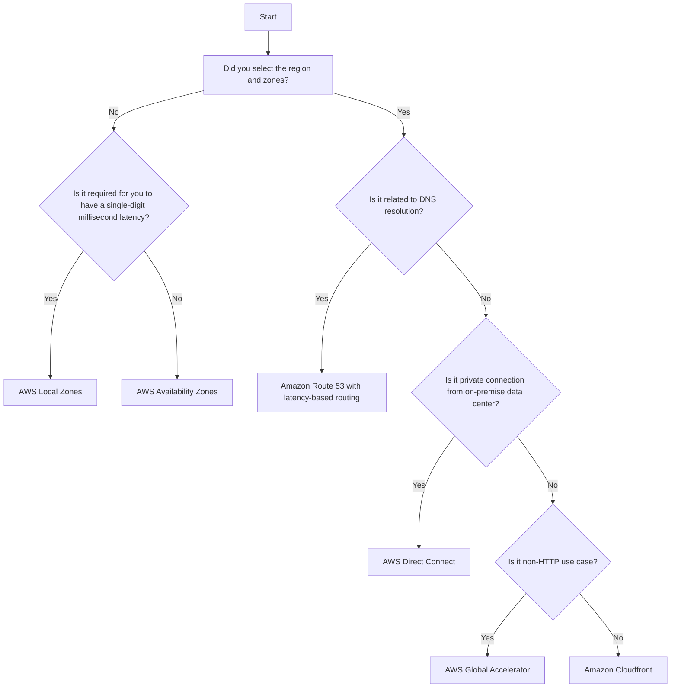

# Edge and Regional Services

[Next: Routing and Balancing](2.routing_and_balancing.md)

```mermaid
graph TD
    A[Start] --> A1[Did you select the region and zones?]
    A1 --> |Yes| B{Is it related to DNS resolution?}
    A1 --> |No| A2{Is it required for you to have a single-digit millisecond latency?}
    A2 --> |Yes|A3[AWS Local Zones] 
                click A3 "https://docs.aws.amazon.com/AWSEC2/latest/UserGuide/using-regions-availability-zones.html#concepts-local-zones"
    A2 --> |No|A4[AWS Availability Zones]
                click A4 "https://docs.aws.amazon.com/AWSEC2/latest/UserGuide/using-regions-availability-zones.html#concepts-availability-zones"
    B -->|Yes| C[Amazon Route 53 with latency-based routing]
               click C "https://docs.aws.amazon.com/Route53/latest/DeveloperGuide/routing-policy-latency.html"
    B -->|No| D{Is it private connection from on-premise data center?}
    
    D -->|Yes| E[AWS Direct Connect]
               click E "https://aws.amazon.com/directconnect/"
    D -->|No| F{Is it non-HTTP use case?}
    
    F -->|Yes| G[AWS Global Accelerator]
                click G "https://aws.amazon.com/global-accelerator/"
    F -->|No| H[Amazon Cloudfront]
                click H "https://aws.amazon.com/cloudfront/"
```

