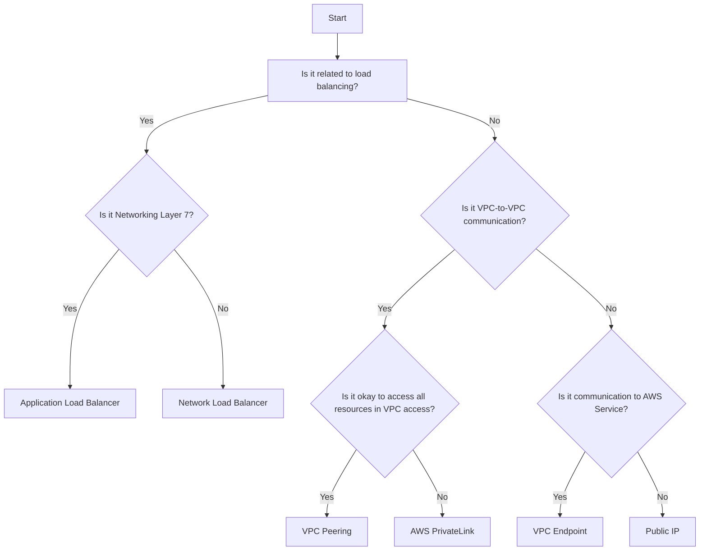

# Routing and Load Balancing

[Previous: Edge and Regional Services](1.edge_and_regional.md) | [Next: Compute Services](3.compute.md)

```mermaid
graph TD
    A[Start] --> B[Is it related to load balancing?]
    B --> |Yes| C1{Is it Networking Layer 7?}
    B --> |No| C2{Is it VPC-to-VPC communication?}
    C1 --> |Yes| D1[Application Load Balancer]
                click D1 "https://docs.aws.amazon.com/elasticloadbalancing/latest/application/introduction.html"
    C1 --> |No| D2[Network Load Balancer]
                click D2 "https://docs.aws.amazon.com/elasticloadbalancing/latest/network/introduction.html"
    C2 --> |Yes| D3{Is it okay to access all resources in VPC access?}
    C2 --> |No| D4{Is it communication to AWS Service?}
    D3 --> |Yes| E1[VPC Peering]
                click E1 "https://docs.aws.amazon.com/vpc/latest/peering/what-is-vpc-peering.html"
    D3 --> |No| E2[AWS PrivateLink]
                click E2 "https://aws.amazon.com/privatelink/"
    D4 --> |Yes| E3[VPC Endpoint]
    D4 --> |No| E4[Public IP]
```