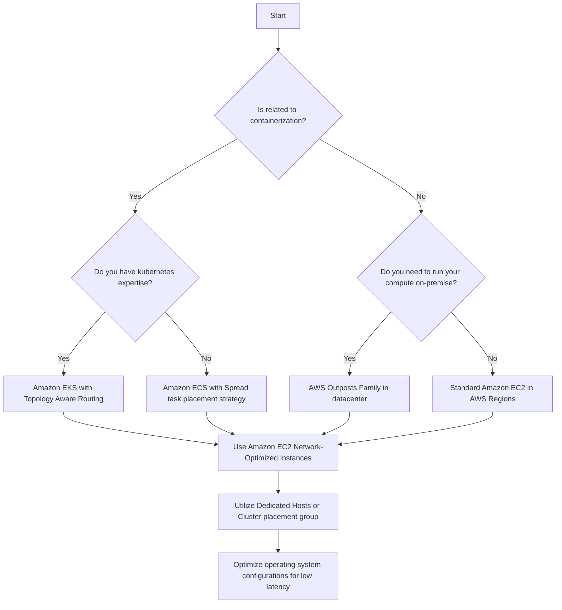

# Compute Services

[Previous: Routing and Balancing](2.routing_and_balancing.md) | [Next: Storage Services](4.storage.md)

```mermaid
graph TD
    A[Start] --> B{Is related to containerization?}
    B --> |Yes| C1{Do you have kubernetes expertise?}
    B --> |No| C2{Do you need to run your compute on-premise?}
    C1 --> |Yes| D1[Amazon EKS with Topology Aware Routing]
            click D1 "https://aws.amazon.com/blogs/containers/exploring-the-effect-of-topology-aware-hints-on-network-traffic-in-amazon-elastic-kubernetes-service/"
    C1 --> |No| D2[Amazon ECS with Spread task placement strategy]
            click D2 "https://docs.aws.amazon.com/AmazonECS/latest/developerguide/strategy-examples.html#even-instance"
    C2 --> |Yes| D3[AWS Outposts Family in datacenter]
            click D3 "https://aws.amazon.com/outposts/"
    C2 --> |No| D4[Standard Amazon EC2 in AWS Regions]
            click D4 "https://docs.aws.amazon.com/AWSEC2/latest/UserGuide/concepts.html"
    D1 --> E1[Use Amazon EC2 Network-Optimized Instances]
    D2 --> E1
    D3 --> E1
    D4 --> E1
    E1 --> F1[Utilize Dedicated Hosts or Cluster placement group]
           click F1 "https://docs.aws.amazon.com/AWSEC2/latest/UserGuide/ena-improve-network-latency-linux.html#ena-latency-reduce-hops"
    F1 --> G1[Optimize operating system configurations for low latency]
            click G1 "https://docs.aws.amazon.com/AWSEC2/latest/UserGuide/ena-improve-network-latency-linux.html"
```