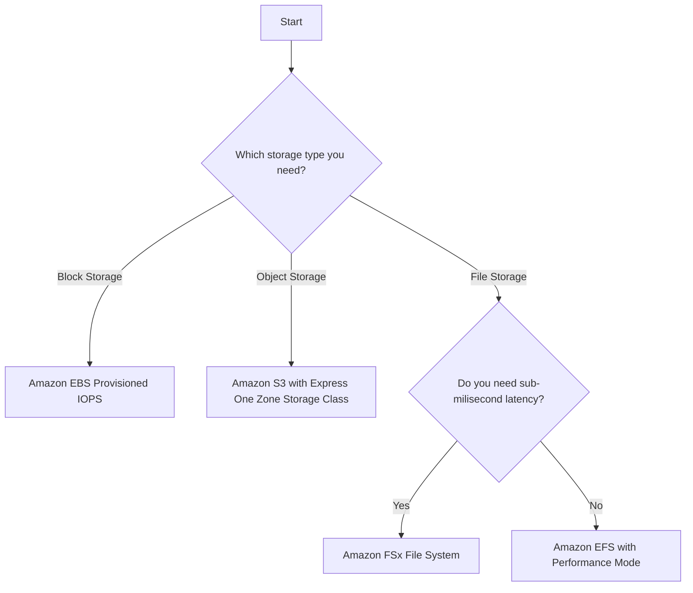

# Storage Services

[Previous: Compute Services](3.compute.md) | [Next: Databases Services](5.databases.md)

```mermaid
graph TD
    A[Start] --> B{Which storage type you need?}
    B --> |Block Storage| C1[Amazon EBS Provisioned IOPS]
           click C1 "https://aws.amazon.com/ebs/provisioned-iops/"
    B --> |Object Storage| C2[Amazon S3 with Express One Zone Storage Class]
           click C2 "https://aws.amazon.com/s3/storage-classes/express-one-zone/"
    B --> |File Storage| C3{Do you need sub-milisecond latency?}
    C3 --> |Yes| D1[Amazon FSx File System]
            click D1 "https://aws.amazon.com/fsx/when-to-choose-fsx/"
    C3 --> |No| D2[Amazon EFS with Performance Mode]
            click D2 "https://docs.aws.amazon.com/efs/latest/ug/performance.html#performancemodes"
```