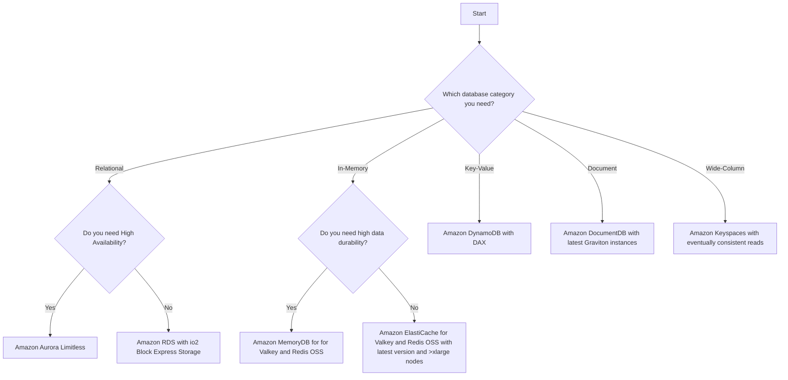

# Database Services

[Previous: Storage Services](4.storage.md) | [Next: Application Integration](6.application_integration.md)

```mermaid
graph TD
    A[Start] --> B{Which database category you need?}
    B --> |Relational| C1{Do you need High Availability?}
    B --> |In-Memory| C2{Do you need high data durability?}
    B --> |Key-Value| C3[Amazon DynamoDB with DAX]
            click C3 "https://aws.amazon.com/blogs/database/understanding-amazon-dynamodb-latency/"
    B --> |Document| C4[Amazon DocumentDB with latest Graviton instances]
            click C4 "https://aws.amazon.com/blogs/database/achieve-better-performance-on-amazon-documentdb-with-aws-graviton2-instances/"
    B --> |Wide-Column| C5[Amazon Keyspaces with eventually consistent reads]
            click C5 "https://aws.amazon.com/blogs/database/announcing-amazon-keyspaces-multi-region-replication/"
    C1 --> |Yes| D1[Amazon Aurora Limitless]
           click D1 "https://aws.amazon.com/blogs/database/benchmarking-amazon-aurora-limitless-with-pgbench/"
    C1 --> |No| D2[Amazon RDS with io2 Block Express Storage]
           click D2 "https://docs.aws.amazon.com/AmazonRDS/latest/UserGuide/CHAP_Storage.html#storage-comparison"
    C2 --> |Yes| D3[Amazon MemoryDB for for Valkey and Redis OSS]
           click D3 "https://aws.amazon.com/blogs/database/measuring-database-performance-of-amazon-memorydb-for-redis/"
    C2 --> |No| D4[Amazon ElastiCache for Valkey and Redis OSS with latest version and >xlarge nodes]
           click D4 "https://aws.amazon.com/blogs/database/achieve-over-500-million-requests-per-second-per-cluster-with-amazon-elasticache-for-redis-7-1/"
```