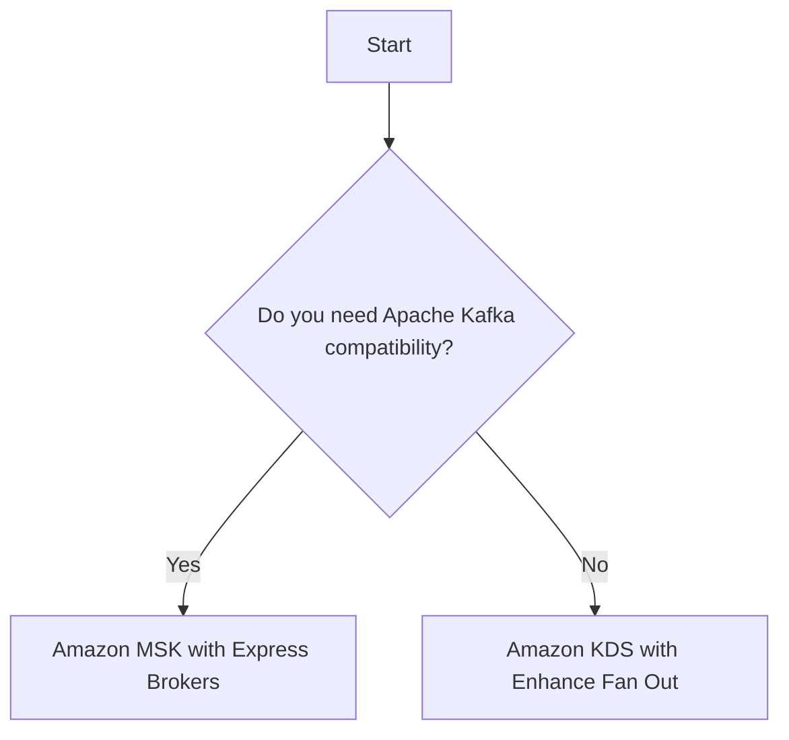

# Application Integration

[Previous: Database Services](5.databases.md)

```mermaid
graph TD
    A[Start] --> B{Do you need Apache Kafka compatibility?}
    B --> |Yes| C1[Amazon MSK with Express Brokers]
                click C1 "https://aws.amazon.com/blogs/aws/introducing-express-brokers-for-amazon-msk-to-deliver-high-throughput-and-faster-scaling-for-your-kafka-clusters/"
    B --> |No| C2[Amazon KDS with Enhance Fan Out]
                click C2 "https://aws.amazon.com/kinesis/data-streams/features/"
```